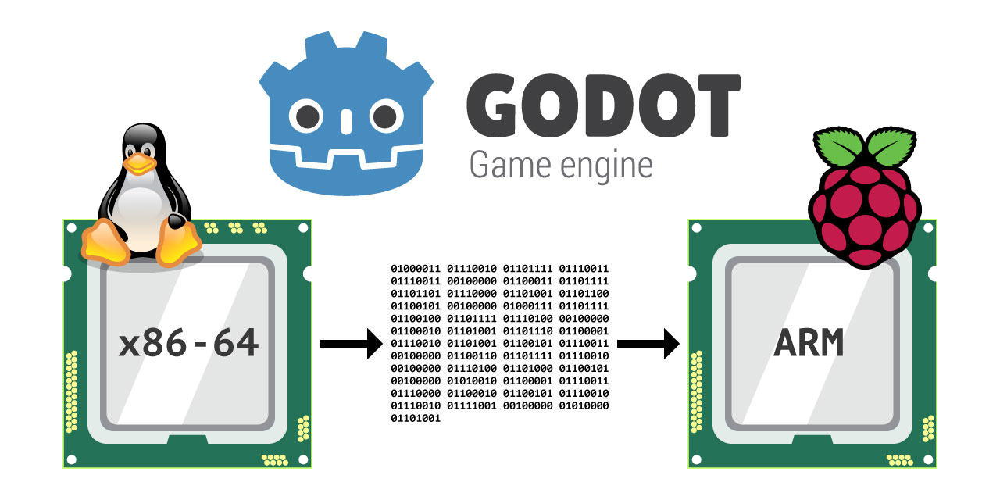

# Cross-compile Godot binaries for the Raspberry Pi

 

A script to easily cross-compile Godot binaries for the Raspberry Pi from Linux x86_64 and an extra script to easily transfer the compiled Godot binaries to the Raspberry Pi using rsync.



## Table of contents

- [Requirements](#requirements)
- [Dependencies](#dependencies)
- [Limitations](#limitations)
- [Pre-compiled binaries](#-pre-compiled-binaries)
- [Setup](#%EF%B8%8F-setup)
- [Usage](#-usage)
- [Options](#-options)
- [Examples](#-examples)
- [Config file](#-config-file)
- [Transfer files to the Raspberry Pi](#transfer-files-to-the-raspberry-pi)

## Requirements:

- [Godot source files](https://github.com/godotengine/godot) (can be downloaded with this script).
- [Godot dependecies to compile for Linux](https://docs.godotengine.org/en/stable/development/compiling/compiling_for_x11.html).
- [Godot toolchain to cross-compile for ARM](https://download.tuxfamily.org/godotengine/toolchains/linux/arm-godot-linux-gnueabihf_sdk-buildroot.tar.bz2) (can be downloaded with this script).

## Dependencies
- `curl`
- `git`
- `jq`
- `tar`
- `wget`
- `zip`

## Limitations

The toolchain this script uses has a few limitations at the moment:

- Only supports cross-compilation for `32 bit` binaries.
- Can't compile Godot `2.x` because it requires `gcc < 6` and the toolchain only has `gcc 10.2`.

Other limitations:

- Raspberry Pi versions `0`, `1` and `2` can't be compiled using Link Time Optimization (LTO).

## 🤖 Pre-compiled binaries

There's a good chance that if you came to this repository you want to compile your own Godot binaries. But if you just want to get pre-compiled binaries, I have another repository with [unofficial Godot binaries for the Raspberry Pi](https://github.com/hiulit/Unofficial-Godot-Engine-Raspberry-Pi).

## 🛠️ Setup

### Install the scripts

```
git clone https://github.com/hiulit/cross-compile-godot-raspberry-pi.git
cd cross-compile-godot-raspberry-pi
sudo chmod +x cross-compile-godot-raspberry-pi.sh
sudo chmod +x transfer-files-raspberry-pi.sh
```

### Update the scripts

```
cd cross-compile-godot-raspberry-pi
git pull
```

## 🚀 Usage

```
./cross-compile-godot-raspberry-pi.sh [OPTIONS]
```

If no options are passed, you will be prompted with a usage example:

```
USAGE: ./cross-compile-godot-raspberry-pi.sh [OPTIONS]

Use './cross-compile-godot-raspberry-pi.sh --help' to see all the options.
```

Log files are stored in `logs/`.

## 📖 Options

- `--help`: Prints the help message.
- `--version`: Prints the script version.
- `--get-tags`: Prints the Godot tags from GitHub available to compile.
- `--get-jobs`: Prints the number of available jobs/CPUs.
- `--download [file] [path]`: Downloads the Godot source files or the Godot toolchain.
  - File: `godot-source-files` or `godot-toolchain`.
  - Path (optional): Path to the directory where the files will be stored.
  - Default path: Same folder as this script.
- `--source-dir [path]`: Sets the Godot source files directory.
  - Default: `./godot`.
- `--toolchain-dir [path]`: Sets the Godot toolchain directory.
  - Default: `./arm-godot-linux-gnueabihf_sdk-buildroot`.
- `--binaries-dir [path]`: Sets the Godot compiled binaries directory.
  - Default: `./compiled-binaries`.
- `--godot-versions [version/s]`: Sets the Godot version/s to compile.
  - Version/s: Use `--get-tags` to see the available versions.
- `--godot-commits [commit/s]`: Sets the Godot commit/s to compile.
  - Commit/s: SHA-1 hash/es.
- `--rpi-versions [version/s]`: Sets the Raspberry Pi version/s to compile.
  - Version/s: `0 1 2 3 4`.
- `--binaries [binary type/s]`: Sets the different types of Godot binaries to compile.
  - Binary type/s: `editor export-template headless server`.
- `--scons-jobs [number|string]`: Sets the jobs (CPUs) to use in SCons.
  - Number: `1-∞`.
  - String: `all` (use all the available CPUs).
  - Default: `1`.
- `--use-lto`: Enables using Link Time Optimization (LTO) when compiling.
- `--pack`: Packs all the binaries of the same Godot version and the same Raspberry Pi version.
- `--auto`: Starts compiling taking the settings in the [config file](#-config-file).

## 💁 Examples

- Compile:
  - The Godot `editor` (version `3.2.3-stable`).
  - For the Raspberry Pi `4`.
  - Using `4` CPU cores.

```
./cross-compile-godot-raspberry-pi.sh --godot-versions "3.2.3-stable" --rpi-versions "4" --binaries "editor" --scons-jobs "4"
```

- Compile:
  - The Godot `editor` (version `3.2.3-stable`) and the `4f891b706027dc800f6949bec413f448defdd20d` commit (which is `3.2.4 RC 3`).
  - For the Raspberry Pi `4`.
  - Using `4` CPU cores.

```
./cross-compile-godot-raspberry-pi.sh --godot-versions "3.2.3-stable" --godot-commits "4f891b706027dc800f6949bec413f448defdd20d" --rpi-versions "4" --binaries "editor" --scons-jobs "4"
```

- Compile:
  - The Godot `editor` (version `3.2.3-stable`).
  - For the Raspberry Pi `3` and `4`.
  - Using `8` CPU cores.
  - With `LTO enabled`.

```
./cross-compile-godot-raspberry-pi.sh --godot-versions "3.2.3-stable" --rpi-versions "3 4" --binaries "editor" --scons-jobs "4" --use-lto
```

- Compile:
  - The Godot `editor` and the `export templates` (versions `3.1.2-stable` and `3.2.3-stable`).
  - For the Raspberry Pi `3` and `4`.
  - Using `all` the available CPU cores.
  - With LTO `enabled`.

```
./cross-compile-godot-raspberry-pi.sh --godot-versions "3.1.2-stable 3.2.3-stable" --rpi-versions "3 4" --binaries "editor export-template" --scons-jobs "all" --use-lto
```

- Compile:
  - The Godot `editor` and the `export templates` (versions `3.1.2-stable` and `3.2.3-stable`).
  - For the Raspberry Pi `3` and `4`.
  - Using `all` the available CPU cores.
  - With `LTO enabled`.
  - Where the Godot source files are located in `/path/to/the/godot/source/files`.

```
./cross-compile-godot-raspberry-pi.sh --source-dir "/path/to/the/godot/source/files" --godot-versions "3.1.2-stable 3.2.3-stable" --rpi-versions "3 4" --binaries "editor export-template" --scons-jobs "all" --use-lto
```

## 📋 Config file

You can edit this file directly, instead of passing all the options mentioned above, and then run:

```
./cross-compile-godot-raspberry-pi.sh --auto
```

```
# Settings for "cross-compile-godot-raspberry-pi.sh".

# Godot source files directory.
# Default: "./godot".
godot_source_files_dir = ""

# Godot toolchain directory.
# Default: "./arm-godot-linux-gnueabihf_sdk-buildroot".
godot_toolchain_dir = ""

# Godot compiled binaries directory.
# Default: "./compiled-binaries".
godot_compiled_binaries_dir = ""

# Godot version/s to compile (separated by blank spaces).
# Use "--get-tags" to see the available versions.
# Version/s must end with the suffix "-stable", except for "master".
godot_versions = ""

# Godot commit/s to compile (separated by blank spaces).
# Commit/s: SHA-1 hash/es.
godot_commits = ""

# Raspberry Pi version/s to compile (separated by blank spaces).
# Version/s: "0 1 2 3 4".
raspberry_pi_versions = ""

# Types of Godot binaries to compile (separated by blank spaces).
# Binary type/s: "editor export-template headless server".
binaries = ""

# Jobs (CPUs) to use in SCons.
# Number: "1-∞".
# String: "all" (use all the available CPUs).
# Default: "1".
scons_jobs = ""

# Use Link Time Optimization (LTO) when compiling.
# Option: "yes".
use_lto = ""

# Pack all the binaries of the same Raspberry Pi version.
# Option: "yes".
pack = ""
```

## Transfer files to the Raspberry Pi

### Requirements:
- SSH key pair.
- SSH passwordless login (optional, but preferable) (https://linuxize.com/post/how-to-setup-passwordless-ssh-login/).
- Static IP on the Raspberry Pi (optional, but preferable).

### Dependencies
- `rsync`

### 🚀 Usage

```
./transfer-files-raspberry-pi.sh [OPTIONS]
```

If no options are passed, you will be prompted with a usage example:

```
USAGE: ./transfer-files-raspberry-pi.sh [OPTIONS]

Use './transfer-files-raspberry-pi.sh --help' to see all the options.
```

Log files are stored in `logs/`.

### 📖 Options

- `--help`: Prints the help message.
- `--version`: Prints the script version.
- `--binaries-dir [path]`: Sets the Godot compiled binaries directory.
  - Default: `./compiled-binaries`.
- `--remote-dir [path]`: Sets the Raspberry Pi directory where the files will be transfered.
  - Default: `/home/pi/godot-binaries/` (note the trailing slash!).
- `--remote-username [username]`: Sets the username of the Raspberry Pi.
- `--remote-ip [IP]`: Sets the IP of the Raspberry Pi.
- `--godot-versions [version/s]`: Sets the Godot version/s to compile.
  - Version/s must end with the suffix `-stable`, except for `master`..
- `--godot-commits [commit/s]`: Sets the Godot commit/s to compile.
  - Commit/s: SHA-1 hash/es.
- `--rpi-versions [version/s]`: Sets the Raspberry Pi version/s to compile.
  - Version/s: `0 1 2 3 4`.
- `--binaries [binary type/s]`: Sets the different types of Godot binaries to compile.
  - Binary type/s: `editor export-template headless server`.
- `--auto`: Starts transfering taking the settings in the [config file](#-config-file-1).

### 💁 Examples

- Transfer:
  - The Godot `editor` (version `3.2.3-stable`).
  - For the Raspberry Pi `4`.
  - To the Raspberry Pi with the username `pi` and the IP `192.168.1.100`.

```
./transfer-files-raspberry-pi.sh --remote-username "pi" --remote-ip "192.168.1.100" --godot-versions "3.2.3-stable" --rpi-versions "4" --binaries "editor"
```

- Transfer:
  - The Godot `editor` (version `3.2.3-stable`).
  - For the Raspberry Pi `4`.
  - To the Raspberry Pi with the username `pi` and the IP `192.168.1.100`.
  - And store the files in `/path/to/the/folder/` (note the trailing slash!).

```
./transfer-files-raspberry-pi.sh --remote-username "pi" --remote-ip "192.168.1.100" --godot-versions "3.2.3-stable" --rpi-versions "4" --binaries "editor" --remote-dir "/path/to/the/folder/"
```

### 📋 Config file

You can edit this file directly, instead of passing all the options mentioned above, and then run:

```
./transfer-files-raspberry-pi.sh --auto
```

```
# Settings for "transfer-files-raspberry-pi.sh".

# Godot compiled binaries directory.
# Default: "./compiled-binaries".
godot_compiled_binaries_dir = ""

# Raspberry Pi directory where the files will be transfered.
# Default: "/home/pi/godot-binaries/" (note the trailing slash!).
remote_dir = ""

# Username of the Raspberry Pi
remote_username = ""

# IP of the Raspberry Pi
remote_ip = ""

# Godot version/s to be transfered (separated by blank spaces).
# Version/s must end with the suffix "-stable", except for "master".
godot_versions = ""

# Godot commit/s to transfer (separated by blank spaces).
# Commit/s: SHA-1 hash/es.
godot_commits = ""

# Raspberry Pi version/s to transfer (separated by blank spaces).
# Version/s: "0 1 2 3 4".
raspberry_pi_versions = ""

# Types of Godot binaries to transfer (separated by blank spaces).
# Binary type/s: "editor export-template headless server".
binaries = ""
```

## 🗒️ Changelog

See [CHANGELOG](/CHANGELOG.md).

## 👤 Author

**hiulit**

- Twitter: [@hiulit](https://twitter.com/hiulit)
- GitHub: [@hiulit](https://github.com/hiulit)

## 🤝 Contributing

Feel free to:

- [Open an issue](https://github.com/hiulit/cross-compile-godot-raspberry-pi/issues) if you find a bug.
- [Create a pull request](https://github.com/hiulit/cross-compile-godot-raspberry-pi/pulls) if you have a new cool feature to add to the project.
- [Start a new discussion](https://github.com/hiulit/cross-compile-godot-raspberry-pi/discussions) about a feature request.

## 🙌 Supporting this project

If you love this project or find it helpful, please consider supporting it through any size donations to help make it better ❤️.

[](https://www.patreon.com/hiulit)

[](https://ko-fi.com/F2F7136ND)

[](https://www.buymeacoffee.com/hiulit)

[](https://www.paypal.com/paypalme/hiulit)

If you can't, consider sharing it with the world...

[](https://twitter.com/intent/tweet?url=https%3A%2F%2Fgithub.com%2Fhiulit%2Fcross-compile-godot-raspberry-pi&text=Cross-compile+Godot+binaries+for+the+Raspberry+Pi%3A%0D%0AA+script+to+easily+cross-compile+Godot+binaries+for+the+Raspberry+Pi+from+Linux+x86_64+by+%40hiulit)

... or giving it a [star ⭐️](https://github.com/hiulit/cross-compile-godot-raspberry-pi/stargazers).

## 👏 Credits

Thanks to:

- Juan Linietsky ([@reduz](https://github.com/reduz)), Ariel Manzur ([@punto-](https://github.com/punto-)), Rémi Verschelde ([@akien-mga](https://github.com/akien-mga)) and all the Godot contributors - For creating and maintaining the [Godot Engine](https://github.com/godotengine/godot).
- [Hein-Pieter van Braam-Stewart](https://github.com/hpvb) - For the [Godot Engine buildroot](https://github.com/godotengine/buildroot), which is the base of this script and for helping me figure out how to use it.
- [Rémi Verschelde](https://github.com/akien-mga) - For helping me with compilation issues.
- **Andrea Calabró** - For the Godot logo used on the banner.
- [Ery Prihananto](https://es.vecteezy.com/arte-vectorial/105957-vector-libre-de-la-cpu) - For the CPU image used on the banner.
- [worldvectorlogo](https://worldvectorlogo.com/es/logo/tux) - For the Tux image used on the banner.
- [Raspberry Pi Foundation](https://www.raspberrypi.org/) - For the Raspberry Pi logo used on the banner.

## 📝 Licenses

- Source code: [MIT License](/LICENSE).
- Godot - Game Engine: [MIT License](/LICENSE_GODOT.txt).
- Godot logo: [CC-BY-4.0 International](https://creativecommons.org/licenses/by/4.0/).
